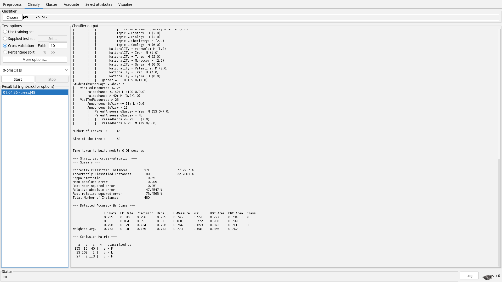

# Results of classification

## Baselines
- ZeroR

- OneR

## Tuned
### Decision Tree J48
- no preprocessing

- no `PlaceOfBirth`

- no `Topic`

- no `VisITedResources`

- no `StudentAbsenceDays`

- with best features

- best features + confidenceFactor = 2

### Random Forest
- no processing

- no without nationality OR place of birth OR (no grade + dummies)

- no parent satisfaction + dummies

- no semester + dummies + 14 depth max

### Logistic Regression
- no process

- no absence

- with best features

- best features + ridge 0.7 + conjugateGradient

## Untuned
### BayesNet

### Bagging

### AdaBoostM1
